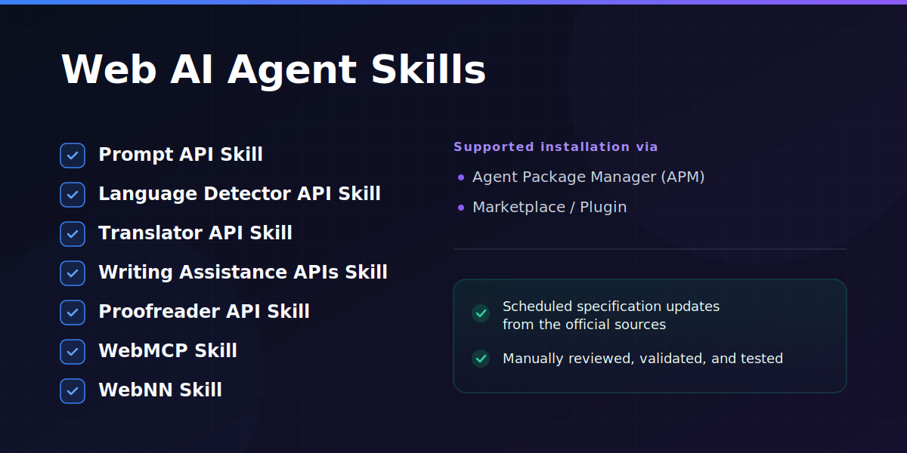

# Web AI Agent Skills



This repository is a maintained collection of agent skills for modern browser Web AI APIs and adjacent AI-native development workflows. The Web AI skills cover Prompt API, Language Detector API, Translator API, Writing Assistance APIs, Proofreader API, WebMCP, and WebNN. The repository also includes workflow-oriented skills for Agent Package Manager (APM) and GitHub Agentic Workflows.

For these APIs, staying close to the latest specification matters. Standards and preview implementations still shift, browser behavior changes across milestones, and many ecosystem examples go stale quickly. These skills reduce that drift so generated or assisted code stays aligned with the current public specification state instead of relying on outdated snippets or guesswork.

I maintain the skills against current specification and platform changes. That work is informed by participation in the [W3C Web Machine Learning Community Group](https://www.w3.org/groups/cg/webmachinelearning/), where several of these APIs are discussed in the open, and by my work as a [Google Developer Expert in Web Technologies](https://developers.google.com/community/experts).

Maintenance also runs through GitHub Agentic Workflows on a weekly cadence. The repository scans the saved `*-skill-update.prompt.md` prompts, checks the relevant specification and reference sources for each skill, and opens draft pull requests only when a run finds material updates worth proposing. Those workflow-generated changes are never auto-merged; every update still requires human review.

The repository follows the agentskills.io style: lean `SKILL.md` files, progressive disclosure through `references/` and `assets/`, and deterministic helper scripts where guessing would be brittle.

The repository has three practical roles:

1. Provide production-style skills for browser Web AI integrations such as Prompt API, WebMCP, and WebNN, plus AI-native development skills where durable workflow assets are useful.
2. Provide a local authoring workflow for creating, validating, and reviewing additional skills.
3. Keep disposable demos and research artifacts separate from persistent skill assets while the durable skill content tracks evolving specifications.

## Quick Install as Plugin

Install all skills at once as a single agent plugin. Pick your environment:

**Claude Code**

```bash
/plugin marketplace add webmaxru/agent-skills
/plugin install web-ai-skills@webmaxru-agent-skills
```

**VS Code (GitHub Copilot)**

Run **Chat: Install Plugin From Source** from the Command Palette and enter:

```text
https://github.com/webmaxru/agent-skills
```

**GitHub Copilot CLI**

```bash
copilot plugin marketplace add webmaxru/agent-skills
copilot plugin install web-ai-skills
```

For per-skill installs, local testing, and advanced options see [Install Skills](#install-skills) and [Agent Plugin Distribution](#agent-plugin-distribution).

## Contents

- [Install Skills](#install-skills)
- [Included Skills](#included-skills)
  - [Web AI API Skills](#web-ai-api-skills)
    - [Prompt API Skill](#prompt-api-skill)
    - [Language Detector API Skill](#language-detector-api-skill)
    - [Translator API Skill](#translator-api-skill)
    - [Writing Assistance APIs Skill](#writing-assistance-apis-skill)
    - [Proofreader API Skill](#proofreader-api-skill)
    - [WebMCP Skill](#webmcp-skill)
    - [WebNN Skill](#webnn-skill)
  - [AI-Native Development Skills](#ai-native-development-skills)
    - [Agent Package Manager Skill](#agent-package-manager-skill)
    - [GitHub Agentic Workflows Skill](#github-agentic-workflows-skill)
- [Agent Plugin Distribution](#agent-plugin-distribution)
  - [Claude Code](#claude-code)
  - [VS Code (GitHub Copilot)](#vs-code-github-copilot)
  - [GitHub Copilot CLI](#github-copilot-cli)
  - [Plugin Structure](#plugin-structure)
- [Supporting Assets](#supporting-assets)
  - [`.github/prompts`](#githubprompts)
  - [GitHub Agentic Workflows Maintenance](#github-agentic-workflows-maintenance)
  - [Skill Creator](#skill-creator)
- [Repository Conventions](#repository-conventions)
- [Common Workflows](#common-workflows)

## Install Skills

Primary installation path: use [Agent Package Manager (APM)](https://github.com/microsoft/apm), a package manager for agent instructions, prompts, skills, and related configuration.

If the target repository does not already use APM, initialize it first:

```bash
apm init
```

Then install any skill from this repository with the repository and skill placeholders replaced as needed:

```bash
apm install OWNER/REPO/skills/SKILL_NAME
```

Secondary installation path: use the `skills` package from npm for direct per-skill installs.

```bash
npx skills add OWNER/REPO --skill SKILL_NAME
```

For this repository, `OWNER/REPO` is `webmaxru/agent-skills`. The concrete install commands for each available skill are listed in the relevant skill sections below.

For example, the Proofreader API skill installs with:

```bash
apm install webmaxru/agent-skills/skills/proofreader-api
```

```bash
npx skills add webmaxru/agent-skills --skill proofreader-api
```

## Included Skills

### Web AI API Skills

#### Prompt API Skill

`skills/prompt-api` is the main production-style example skill in the repository. It is scoped to browser Prompt API work in JavaScript or TypeScript web apps.

Install with APM:

```bash
apm install webmaxru/agent-skills/skills/prompt-api
```

Install with npm:

```bash
npx skills add webmaxru/agent-skills --skill prompt-api
```

It covers:

- identifying the correct frontend target in a workspace
- confirming Prompt API viability before code changes
- implementing a guarded session wrapper around `LanguageModel`
- wiring download, ready, sending, and fallback UX states
- validating integrations and handling browser-specific failures

Its support files are split by purpose:

- `references/prompt-api-reference.md` for API surface, validation rules, and platform constraints
- `references/examples.md` for valid prompt shapes and implementation patterns
- `references/compatibility.md` for availability, flags, typings, and breaking-change mapping
- `references/polyfills.md` for native-first polyfill strategies and backend configuration
- `references/troubleshooting.md` for runtime failure cases such as missing `LanguageModel`, iframe issues, and stale session cleanup
- `assets/language-model-service.template.ts` for a reusable wrapper template
- `scripts/find-frontend-targets.mjs` for deterministic scanning of likely web entry points and Prompt API markers

#### Language Detector API Skill

`skills/language-detector-api` is scoped to browser Language Detector API integrations in JavaScript or TypeScript web apps.

Install with APM:

```bash
apm install webmaxru/agent-skills/skills/language-detector-api
```

Install with npm:

```bash
npx skills add webmaxru/agent-skills --skill language-detector-api
```

It covers:

- identifying the correct browser app surface for language-detection work
- confirming secure-context, permissions-policy, and browser-preview viability before code changes
- implementing guarded `availability()` and `create()` flows with download progress handling
- wiring confidence-aware `detect()` results, `und` handling, and quota-aware `measureInputUsage()` checks
- validating cleanup, abort behavior, iframe delegation, and preview-specific compatibility limits

Its support files are split by purpose:

- `references/language-detector-reference.md` for API surface, lifecycle rules, result semantics, and permissions-policy constraints
- `references/examples.md` for support detection, monitored creation, confidence-aware ranking, and cleanup patterns
- `references/compatibility.md` for browser rollout notes, preview flags, iframe rules, and typing guidance
- `references/troubleshooting.md` for missing globals, unavailable models, quota issues, uncertain results, and worker mismatches
- `assets/language-detector-session.template.ts` for a reusable typed session wrapper template
- `scripts/find-language-detector-targets.mjs` for deterministic scanning of likely web entry points and Language Detector API markers

#### Translator API Skill

`skills/translator-api` is scoped to browser Translator API integrations in JavaScript or TypeScript web apps.

Install with APM:

```bash
apm install webmaxru/agent-skills/skills/translator-api
```

Install with npm:

```bash
npx skills add webmaxru/agent-skills --skill translator-api
```

It covers:

- identifying the correct browser app surface for on-device translation work
- confirming secure-context, permissions-policy, and language-pair viability before code changes
- implementing guarded `availability()` and `create()` flows with download progress handling
- wiring `translate()`, `translateStreaming()`, input-usage checks, cancellation, and cleanup through `destroy()`
- validating browser-specific preview limits, iframe delegation, and unchanged-output edge cases such as identity translation

Its support files are split by purpose:

- `references/translator-reference.md` for API surface, lifecycle rules, permission-policy requirements, and quota behavior
- `references/examples.md` for support detection, monitored creation, full-result translation, streaming translation, and cleanup patterns
- `references/compatibility.md` for browser rollout notes, preview flags, iframe rules, and typing guidance
- `references/troubleshooting.md` for missing globals, blocked creation, quota issues, filtered output, and worker mismatches
- `assets/translator-session.template.ts` for a reusable typed session wrapper template
- `scripts/find-translator-targets.mjs` for deterministic scanning of likely web entry points and Translator API markers

#### Writing Assistance APIs Skill

`skills/writing-assistance-apis` is scoped to browser Summarizer, Writer, and Rewriter integrations in JavaScript or TypeScript web apps.

Install with APM:

```bash
apm install webmaxru/agent-skills/skills/writing-assistance-apis
```

Install with npm:

```bash
npx skills add webmaxru/agent-skills --skill writing-assistance-apis
```

It covers:

- identifying the correct browser app surface for writing assistance work
- confirming API availability, secure-context requirements, and download readiness before code changes
- implementing guarded session creation, batch and streaming output flows, and cleanup through `destroy()` or abort signals
- wiring user-visible download, ready, generating, canceled, and fallback UX states
- validating browser-specific preview limits, permissions-policy constraints, and option-specific failure cases

Its support files are split by purpose:

- `references/writing-assistance-reference.md` for shared lifecycle rules, session methods, option surfaces, and iframe permission requirements
- `references/examples.md` for feature detection, monitored creation, batch usage, streaming usage, cancellation, and cleanup patterns
- `references/compatibility.md` for browser rollout notes, preview flags, hardware constraints, and support boundaries
- `references/troubleshooting.md` for missing globals, `NotAllowedError`, `NotSupportedError`, quota issues, and streaming failures
- `assets/writing-assistance-session.template.ts` for a reusable typed wrapper template
- `scripts/find-writing-assistance-targets.mjs` for deterministic scanning of likely web entry points and Writing Assistance API markers

#### Proofreader API Skill

`skills/proofreader-api` is scoped to browser Proofreader API integrations in JavaScript or TypeScript web apps.

Install with APM:

```bash
apm install webmaxru/agent-skills/skills/proofreader-api
```

Install with npm:

```bash
npx skills add webmaxru/agent-skills --skill proofreader-api
```

It covers:

- identifying the correct browser app surface for proofreading work
- confirming secure-context, permissions-policy, and preview-browser viability before code changes
- implementing guarded `availability()` and `create()` flows with download progress handling
- wiring `proofread()` result handling, correction rendering, and quota-aware `measureInputUsage()` checks
- validating cleanup, unsupported-option fallbacks, and preview-specific compatibility limits

Its support files are split by purpose:

- `references/proofreader-reference.md` for API surface, lifecycle rules, result shape, and permissions-policy constraints
- `references/examples.md` for support detection, monitored creation, correction rendering, quota-aware checks, and cleanup patterns
- `references/compatibility.md` for spec-versus-preview differences, browser rollout notes, flags, hardware requirements, and typing guidance
- `references/troubleshooting.md` for missing globals, unavailable models, unsupported option combinations, runtime failures, and worker mismatches
- `assets/proofreader-session.template.ts` for a reusable typed session wrapper template
- `scripts/find-proofreader-targets.mjs` for deterministic scanning of likely web entry points and Proofreader API markers

#### WebMCP Skill

`skills/webmcp` is scoped to browser WebMCP integrations in JavaScript or TypeScript web apps.

Install with APM:

```bash
apm install webmaxru/agent-skills/skills/webmcp
```

Install with npm:

```bash
npx skills add webmaxru/agent-skills --skill webmcp
```

It covers:

- identifying the correct browser app surface for WebMCP work
- choosing between imperative `navigator.modelContext` tools and declarative form annotations
- implementing guarded registration and cleanup for page-hosted tools
- handling preview-specific agent-invoked form flows without making them the portability baseline
- validating WebMCP behavior against the current Chrome preview and public draft

Its support files are split by purpose:

- `references/webmcp-reference.md` for core WebMCP concepts, API semantics, and registration rules
- `references/declarative-api.md` for declarative form annotations, submit handling, and related preview behavior
- `references/compatibility.md` for Chrome preview requirements, removed surfaces, and draft-versus-preview differences
- `references/troubleshooting.md` for missing `navigator.modelContext`, registration failures, and stale UI issues
- `assets/model-context-registry.template.ts` for a reusable imperative registration helper
- `scripts/find-webmcp-targets.mjs` for deterministic scanning of likely web entry points and WebMCP markers

#### WebNN Skill

`skills/webnn` is scoped to browser Web Neural Network API integrations in JavaScript or TypeScript web apps.

Install with APM:

```bash
apm install webmaxru/agent-skills/skills/webnn
```

Install with npm:

```bash
npx skills add webmaxru/agent-skills --skill webnn
```

It covers:

- identifying the correct browser integration surface for local inference work
- confirming secure-context, `navigator.ml`, and device viability before code changes
- implementing guarded `MLContext` and `MLGraphBuilder` flows with explicit runtime selection
- wiring fallback behavior for unsupported devices or browsers without silently switching to remote inference
- validating context creation, graph execution, tensor readback, and preview-specific behavior against the current spec and runtime landscape

Its support files are split by purpose:

- `references/webnn-reference.md` for API surface, execution model, and graph/runtime rules
- `references/examples.md` for direct graph and adapter implementation patterns
- `references/compatibility.md` for browser support, preview requirements, and backend differences
- `references/troubleshooting.md` for context creation failures, dispatch issues, readback problems, and device fallback behavior
- `assets/webnn-runtime.template.ts` for a reusable runtime wrapper template
- `scripts/find-webnn-targets.mjs` for deterministic scanning of likely web entry points and WebNN markers

### AI-Native Development Skills

#### Agent Package Manager Skill

`skills/agent-package-manager` is scoped to installing, configuring, auditing, and operating Agent Package Manager (APM) in repositories that use agent instructions, skills, prompts, or MCP integrations.

Install with APM:

```bash
apm install webmaxru/agent-skills/skills/agent-package-manager
```

Install with npm:

```bash
npx skills add webmaxru/agent-skills --skill agent-package-manager
```

It covers:

- assessing existing APM state across `apm.yml`, `apm.lock.yaml`, tool config folders, and installed modules before making changes
- shaping or repairing `apm.yml` deliberately, including package dependencies, MCP servers, scripts, and reproducible dependency forms
- using `apm install`, `apm deps`, and dry-run flows to manage packages and lockfiles without guesswork
- validating when `apm compile` is useful, when install-only flows are sufficient, and how explicit targets affect generation
- operating scripts, runtimes, pack and unpack workflows, and CI-oriented distribution paths professionally

Its support files are split by purpose:

- `references/manifest-and-lockfile.md` for manifest structure, dependency forms, lockfile expectations, and configuration guidance
- `references/command-workflows.md` for install, update, prune, compile, preview, runtime, and bundle workflows
- `references/troubleshooting.md` for authentication issues, collisions, compile confusion, pack failures, and related recovery paths
- `assets/apm.yml.template` for a reusable manifest starter or repair template

#### GitHub Agentic Workflows Skill

`skills/github-agentic-workflows` is scoped to professional authoring, review, installation, debugging, and day-two operation of GitHub Agentic Workflows repositories.

Install with APM:

```bash
apm install webmaxru/agent-skills/skills/github-agentic-workflows
```

Install with npm:

```bash
npx skills add webmaxru/agent-skills --skill github-agentic-workflows
```

It covers:

- identifying whether a repository already uses GH-AW and locating its active workflow surfaces
- creating or revising workflow markdown, frontmatter, and compile-time configuration professionally
- choosing safe outputs, network policy, authentication, and lockdown settings with least privilege
- validating, compiling, running, and auditing workflows with the `gh aw` CLI
- diagnosing common setup, compilation, permissions, network, and engine failures

Its support files are split by purpose:

- `references/authoring.md` for repository setup, workflow structure, frontmatter priorities, and validation loops
- `references/examples.md` for proven workflow shapes, creation prompts, orchestration decisions, and production review areas
- `references/security-and-operations.md` for safe outputs, network policy, authentication, lockdown, and observability guidance
- `references/troubleshooting.md` for installation failures, enterprise policy blockers, compile issues, safe-output failures, and runtime debugging
- `assets/workflow.template.md` for a reusable markdown workflow starter
- `scripts/find-gh-aw-targets.mjs` for deterministic scanning of workflow files and GH-AW markers

## Agent Plugin Distribution

All skills in this repository are also available as a single agent plugin. Installing the plugin gives you every skill at once. The plugin format is shared between Claude Code, VS Code (GitHub Copilot), and GitHub Copilot CLI, so the same `plugin.json` manifest and `skills/` directory work across all three environments.

### Claude Code

#### Test locally

Clone the repository and point Claude Code at it:

```bash
git clone https://github.com/webmaxru/agent-skills.git
claude --plugin-dir ./agent-skills
```

Once Claude Code starts, available skills appear behind the `web-ai-skills:` namespace:

```text
/web-ai-skills:prompt-api
/web-ai-skills:webmcp
/web-ai-skills:webnn
```

Run `/reload-plugins` after any local edits to pick up changes without restarting.

#### Install from the Claude Code marketplace

If the plugin has been published to a marketplace, install it with:

```bash
/plugin install web-ai-skills@<marketplace-name>
```

Replace `<marketplace-name>` with the marketplace that hosts the plugin (for example, `claude-plugins-official` for the official Anthropic marketplace).

To submit the plugin to the official Anthropic marketplace, use one of the in-app submission forms:

- Claude.ai: [claude.ai/settings/plugins/submit](https://claude.ai/settings/plugins/submit)
- Console: [platform.claude.com/plugins/submit](https://platform.claude.com/plugins/submit)

#### Install from this GitHub repository as a marketplace

This repository can also act as its own marketplace. Add it with:

```bash
/plugin marketplace add webmaxru/agent-skills
```

Then install the plugin:

```bash
/plugin install web-ai-skills@webmaxru-agent-skills
```

### VS Code (GitHub Copilot)

> **Note:** Agent plugins in VS Code are currently in preview. Enable support with the `chat.plugins.enabled` setting.

#### Test locally

Clone the repository and register its path in your VS Code settings:

```jsonc
// settings.json
"chat.pluginLocations": {
    "/path/to/agent-skills": true
}
```

After reloading the window, the skills appear in **Chat: Configure Skills** and can be invoked in any Copilot chat session.

#### Install from source

Run **Chat: Install Plugin From Source** from the Command Palette and enter the repository URL:

```text
https://github.com/webmaxru/agent-skills
```

VS Code clones the repository and installs the plugin automatically.

#### Install from a marketplace

Add this repository as a marketplace in your VS Code settings:

```jsonc
// settings.json
"chat.plugins.marketplaces": [
    "webmaxru/agent-skills"
]
```

Then open the Extensions view, search `@agentPlugins`, and install **web-ai-skills** from the list.

#### Workspace recommendation

Projects can recommend the plugin for team members by adding it to `.vscode/settings.json`:

```jsonc
// .vscode/settings.json
{
    "extraKnownMarketplaces": {
        "webmaxru-agent-skills": {
            "source": {
                "source": "github",
                "repo": "webmaxru/agent-skills"
            }
        }
    },
    "enabledPlugins": {
        "web-ai-skills@webmaxru-agent-skills": true
    }
}
```

VS Code notifies team members about the recommended plugin the first time they send a chat message.

### GitHub Copilot CLI

#### Install locally

Clone the repository and install the plugin with the `copilot` CLI:

```bash
git clone https://github.com/webmaxru/agent-skills.git
copilot plugin install ./agent-skills
```

Verify the plugin loaded:

```bash
copilot plugin list
```

Inside an interactive session, check that skills are available:

```text
/skills list
```

After making changes to a local plugin, reinstall it to refresh the cache:

```bash
copilot plugin install ./agent-skills
```

#### Install from this GitHub repository as a marketplace

Add this repository as a marketplace:

```bash
copilot plugin marketplace add webmaxru/agent-skills
```

Then install the plugin:

```bash
copilot plugin install web-ai-skills
```

#### Uninstall

```bash
copilot plugin uninstall web-ai-skills
```

### Plugin structure

The plugin is defined by the manifest at `.claude-plugin/plugin.json` and reuses the existing `skills/` directory:

```
agent-skills/                        (plugin root)
├── .claude-plugin/
│   ├── plugin.json                  # Plugin manifest
│   └── marketplace.json             # Marketplace catalog (Claude Code / VS Code)
├── .github/
│   └── plugin/
│       └── marketplace.json         # Marketplace catalog (Copilot CLI)
└── skills/                          # All skills
    ├── prompt-api/
    │   └── SKILL.md
    ├── language-detector-api/
    │   └── SKILL.md
    ├── translator-api/
    │   └── SKILL.md
    ├── writing-assistance-apis/
    │   └── SKILL.md
    ├── proofreader-api/
    │   └── SKILL.md
    ├── webmcp/
    │   └── SKILL.md
    ├── webnn/
    │   └── SKILL.md
    ├── agent-package-manager/
    │   └── SKILL.md
    └── github-agentic-workflows/
        └── SKILL.md
```

Each skill directory includes its own `references/`, `assets/`, and `scripts/` supporting files, which are bundled with the plugin automatically.

## Supporting Assets

### `.github/prompts`

These prompt files support maintenance workflows in this repo:

- `create-web-ai-skill.prompt.md` runs a five-phase workflow for a skill under `skills/`: creation, validation and remediation, supporting prompt creation, README update, and install verification; it also supports explicit single-phase execution through a `step=` selector
- `validate-skills.prompt.md` reviews skills against the local authoring workflow
- `remediate-skills.prompt.md` applies targeted fixes to skills
- `agent-package-manager-skill-update.prompt.md` refreshes the Agent Package Manager skill from current documentation and user-supplied updates
- `github-agentic-workflows-skill-update.prompt.md` refreshes the GitHub Agentic Workflows skill from current GH-AW documentation, related references, and user-supplied updates
- `prompt-api-skill-update.prompt.md` refreshes the Prompt API skill from current docs and user-supplied updates
- `proofreader-api-skill-update.prompt.md` refreshes the Proofreader API skill from user-supplied updates, attachments, and the current specification and browser guidance
- `language-detector-api-skill-update.prompt.md` refreshes the Language Detector API skill from user-supplied updates, attachments, and the current specification and browser guidance
- `translator-api-skill-update.prompt.md` refreshes the Translator API skill from user-supplied updates, attachments, and the current specification and browser guidance
- `writing-assistance-apis-skill-update.prompt.md` refreshes the Writing Assistance APIs skill from user-supplied updates, attachments, and the current specification state
- `webmcp-skill-update.prompt.md` refreshes the WebMCP skill from user-supplied updates, attachments, and the current specification state
- `webnn-skill-update.prompt.md` refreshes the WebNN skill from user-supplied updates, attachments, and the current specification state
- `prompt-api-create-chat-demo-plain-html.prompt.md` recreates or extends a plain HTML Prompt API demo under `artifacts/prompt-api/`
- `proofreader-api-create-demo-plain-html.prompt.md` creates or recreates a plain HTML Proofreader API demo under `artifacts/proofreader-api/`
- `language-detector-api-create-demo-plain-html.prompt.md` creates or recreates a plain HTML Language Detector API demo under `artifacts/language-detector-api/`
- `translator-api-create-demo-plain-html.prompt.md` creates or recreates a plain HTML Translator API demo under `artifacts/translator-api/`
- `writing-assistance-apis-create-demo-plain-html.prompt.md` creates or recreates a plain HTML Writing Assistance APIs demo under `artifacts/writing-assistance-apis/`
- `webmcp-create-demo-plain-html.prompt.md` creates or recreates a plain HTML WebMCP demo under `artifacts/webmcp/`
- `webnn-create-demo-plain-html.prompt.md` creates or recreates a plain HTML WebNN demo under `artifacts/webnn/`
- `add-agent-plugin-distribution.prompt.md` adds Claude Code, VS Code (GitHub Copilot), and Copilot CLI plugin distribution to any agent skills repository — creates manifests, marketplace catalogs, and README documentation

### GitHub Agentic Workflows Maintenance

GitHub Agentic Workflows are the repository's automation layer for recurring skill maintenance, especially weekly spec-alignment passes.

In this repo they work as follows:

- `.github/workflows/weekly-skill-updates.yml` runs every Monday at 08:00 UTC and can also be triggered manually for a single saved prompt
- the workflow discovers every `.github/prompts/*-skill-update.prompt.md` file and fans out one run per selected prompt
- each run executes the reusable worker compiled from `.github/workflows/skill-update-worker.md` via `.github/workflows/skill-update-worker.lock.yml`
- the worker prefetches the external URLs referenced by the selected saved prompt into local runtime files under `.github/aw/`, then points the agent at those files so the run uses deterministic local inputs instead of ad hoc live browsing
- the worker runs in `strict` mode with constrained tools and network access, and uses `safe-outputs` to create at most one draft pull request for that prompt or emit `noop` if no material update is justified
- pull requests are intentionally created as drafts and are not merged by the workflow; a human review is required before any update is merged

This is how the repository keeps skills updated weekly from multiple relevant sources without turning speculative agent output into unattended repository writes.

### Skill Creator

`.agents/skills/skill-creator` is the local authoring skill and repository source of truth for creating and reviewing skills.

It includes:

- `SKILL.md` with the authoring procedure
- `scripts/validate-metadata.py` for metadata validation
- `assets/SKILL.template.md` as a starting point for new skills
- `references/checklist.md` for final review

Use it when creating or revising agent skills. Do not use it for generic repository documentation or other non-skill content.

## Repository Conventions

When adding or revising a skill here, keep these rules intact:

1. The skill directory name must match the YAML `name` exactly.
2. Skill descriptions should be precise enough to route correctly and include both positive and negative triggers.
3. `SKILL.md` should stay lean, procedural, and agent-oriented.
4. Large examples, verbose rules, and schemas belong in `references/` or `assets/`.
5. File paths inside skills should stay relative and use forward slashes.
6. Skill folders should remain flat under `scripts/`, `references/`, and `assets/`.
7. Human-oriented files such as per-skill `README.md` or `CHANGELOG.md` should not be added inside skill directories.
8. The validation path for new or revised skills is `.agents/skills/skill-creator/scripts/validate-metadata.py` plus `.agents/skills/skill-creator/references/checklist.md`.

## Common Workflows

### Validate Skill Metadata

```bash
python .agents/skills/skill-creator/scripts/validate-metadata.py \
  --name "your-skill-name" \
  --description "Describes what the skill does, when to use it, and when not to use it."
```

The validator checks naming rules, description length, and whether the description leaks first- or second-person phrasing.

### Scan a Workspace for Frontend Targets

```bash
node skills/prompt-api/scripts/find-frontend-targets.mjs .
```

The scanner prioritizes common web entry points such as `package.json`, `index.html`, and framework bootstrap files while ignoring transient directories such as `node_modules`, `dist`, `build`, `.next`, `.nuxt`, `coverage`, `out`, and `target`.

### Scan a Workspace for GitHub Agentic Workflow Targets

```bash
node skills/github-agentic-workflows/scripts/find-gh-aw-targets.mjs .
```

The scanner inventories `.github/workflows/` files, highlights repository setup surfaces such as `.github/agents/agentic-workflows.agent.md`, and reports GH-AW markers including `gh aw`, `safe-outputs:`, `network:`, and orchestration fields.

### Scan a Workspace for Writing Assistance Targets

```bash
node skills/writing-assistance-apis/scripts/find-writing-assistance-targets.mjs .
```

The scanner prioritizes common browser entry points and reports existing Writing Assistance API markers such as `Summarizer`, `Writer`, `Rewriter`, and their streaming methods.

### Scan a Workspace for Proofreader Targets

```bash
node skills/proofreader-api/scripts/find-proofreader-targets.mjs .
```

The scanner prioritizes common browser entry points and reports existing Proofreader API markers such as `Proofreader`, `proofread()`, correction-detail options, and the `proofreader` permissions-policy token.

### Scan a Workspace for WebMCP Targets

```bash
node skills/webmcp/scripts/find-webmcp-targets.mjs .
```

The scanner prioritizes common web entry points and reports existing imperative or declarative WebMCP markers such as `navigator.modelContext`, `registerTool()`, `unregisterTool()`, and form tool annotations.

### Scan a Workspace for WebNN Targets

```bash
node skills/webnn/scripts/find-webnn-targets.mjs .
```

The scanner prioritizes common browser app entry points and reports existing local inference markers such as `navigator.ml`, `createContext()`, `MLGraphBuilder`, and related runtime setup code.

### Create a New Skill

1. Draft a valid `name` and a routing-focused `description`.
2. Run the metadata validator until it passes.
3. Create a new folder under `skills/`.
4. Start from `.agents/skills/skill-creator/assets/SKILL.template.md`.
5. Keep the main procedure in `SKILL.md` and move bulky detail into `references/` or `assets/`.
6. Review the result against `.agents/skills/skill-creator/references/checklist.md`.

### Run The Create Skill Prompt

The saved prompt named `Create Skill` supports a mandatory five-phase full workflow and direct single-phase execution. Use the exact argument text below when invoking that saved prompt.

Full workflow, all five phases mandatory:

```text
Create Skill: step=all
```

Then reply to the prompt's required questions in order:

```text
webgpu-audio
```

```text
Browser-side use of WebGPU audio processing in JavaScript or TypeScript web apps, including capability checks, initialization, error handling, and compatibility limits.
```

```text
URLs:
- https://example.com/spec

Attached documents:
- webgpu-audio-notes.pdf

Notes:
- Focus on browser-only usage.
- Stop when secure context or feature flags are missing.
```

Phase 1 only, skill creation:

```text
Create Skill: step=create
```

Then reply in the same required order: skill name, skill scope, then source materials.

Phase 2 only, validation and remediation for an existing skill:

```text
Create Skill: step=validate-remediate skill-name=webgpu-audio
```

Phase 3 only, supporting saved prompts for an existing skill:

```text
Create Skill: step=supporting-prompts skill-name=webgpu-audio
```

Phase 4 only, root README update for an existing skill:

```text
Create Skill: step=readme-update skill-name=webgpu-audio
```

Phase 5 only, install verification for an existing skill:

```text
Create Skill: step=install-test skill-name=webgpu-audio
```

Another direct example with inline scope details:

```text
Create Skill: step=validate-remediate skill-name=webnn notes="tighten negative triggers and re-check metadata"
```

## References

- agentskills.io best practices: https://platform.claude.com/docs/en/agents-and-tools/agent-skills/best-practices
- skill-creator template and checklist: https://github.com/mgechev/skills-best-practices
- skill-eval benchmark: https://github.com/mgechev/skill-eval

